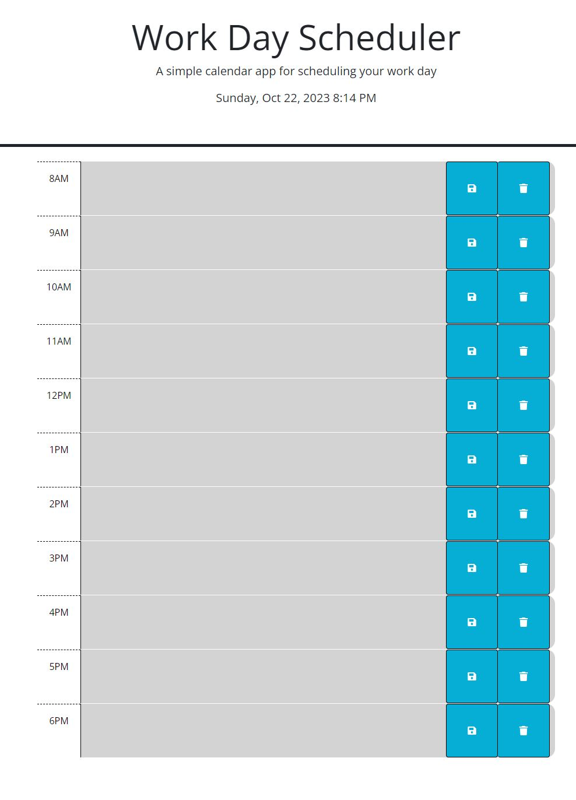

# Work Day Scheduler
Module 5 Challenge

## Description
This site was created to assit employees with organizing their schedule. It lets them add events to their daily planner so, they could manage their time effectively.

## Usage
To open the site click on the following link.\
https://angiem07.github.io/Work-Day-Scheduler/

Below is a preview of the site.

To use, add schedule description to the text box next to the appropiate time slot, then click the save button to the right of the page.

To clear, click the clear button (trash can icon).

The schedule is color coden denpending on past, present and future events.
past: grey
present: red
future: green

## Credits
Original code given by bootcamp course.

References:\
Module 5 Mini Project\
https://day.js.org/docs/en/parse/string-format \
https://alananibal.github.io/Work-Day-Scheduler/ \
https://www.w3schools.com/icons/fontawesome_icons_webapp.asp \
https://developer.mozilla.org/en-US/docs/Web/API/Window/localStorage \
https://developer.mozilla.org/en-US/docs/Web/HTML/Element/button \
https://stackoverflow.com/questions/12481439/jquery-this-keyword \
ChatGPT 

Debug:\
ChatGPT

## License
N/A

